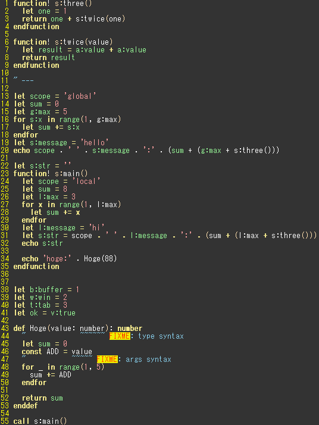
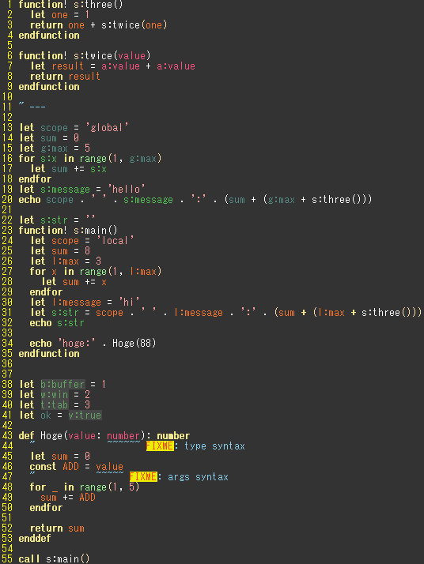
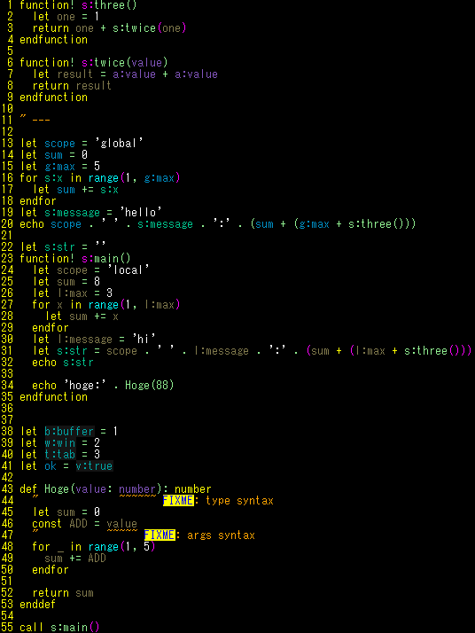

# vim-vimscript-scope-syntax

The Vim script scope syntax highlighting plugin for vim.

# ToDo

- [ ] Fix Vim9 script syntax

# Demo

Highlight color is auto generate.  
For example, desert colorscheme

|before|after|
|---|---|
|||

murphy

|before|after|
|---|---|
|||


# Installing

For [vim-plug](https://github.com/junegunn/vim-plug) plugin manager:

```vim
Plug 'wordijp/vim-vimscript-scope-syntax'
```

# Usage

The syntax hilight color is calculated automatically.  
If you want to change it, turn off the auto-enable option and set yourself for each highlight

```vim
let g:vimscript_scope_syntax_auto_enable = 0
```

## Scope highlight list

- vimGlobalVar
- vimScriptVar
- vimLocalVar
- vimArgsVar
- vimBufVar
- vimWinVar
- vimTabVar
- vimVVar

## For guifg disabled users

Auto set hilight is `guifg` and `guibg` only, Please set the `ctermfg`  and `ctermbg` by yourself.

For example:

```vim
" .vim/after/syntax/vim.vim
hi vimGlobalVar ctermfg=darkcyan
hi vimScriptVar ctermfg=darkgreen
hi vimLocalVar  ctermfg=brown
hi vimArgsVar   ctermfg=darkred

hi vimBufVar    ctermfg=darkgreen ctermbg=darkblue
hi vimWinVar    ctermfg=darkgreen ctermbg=darkblue
hi vimTabVar    ctermfg=darkgreen ctermbg=darkblue
hi vimVVar      ctermfg=darkgreen ctermbg=darkblue
```

# License

MIT
